# Lab 2.1: Evidence Intake and Chain of Custody Documentation

Course: SEC 350HB – Digital Forensics 

Lab: NDG Forensics v2 - Lab 2.1

Date: January 30, 2026

Student: Vivian John Goshashy

## Lab Overview

This lab focused on one of the most critical aspects of digital forensics: Chain of Custody (CoC) documentation. Proper chain of custody procedures ensure that evidence is admissible in court by demonstrating that it has been properly handled, controlled, and preserved from the moment of seizure through examination and storage.

## Learning Objectives

* Identify and document critical device identifiers (serial numbers, model numbers, IMEI)

* Create detailed physical descriptions of evidence items

* Complete an Evidence Intake Form with proper case information

* Fill out a Chain of Custody form tracking evidence movement

* Understand proper file naming conventions for forensic documentation

## Tools Used

* WinOS Virtual Machine (Windows environment)

* NDG Lab Environment - Lab 21: Chain of Custody

* Adobe PDF Viewer (for form completion)

* Evidence Repository (provided lab files and exhibit photos)

Lab Environment

The lab environment provided access to the WinOS virtual machine where I navigated through the evidence repository to access exhibit photos and forensic forms.

## Part 1: Documenting Seized Devices

## Accessing Exhibit Photos

I began by navigating to ThisPC > Evidence Repository (E:) > FOR_LAB_021 > Exhibit photos to access the photos of seized devices.

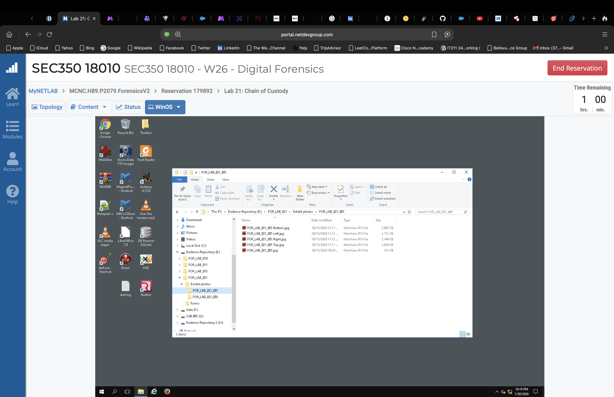

## Evidence Item 001: Hitachi Hard Drive

The first exhibit was a 3.5" Hitachi hard drive. Using the provided exhibit photos, I identified the following critical information:

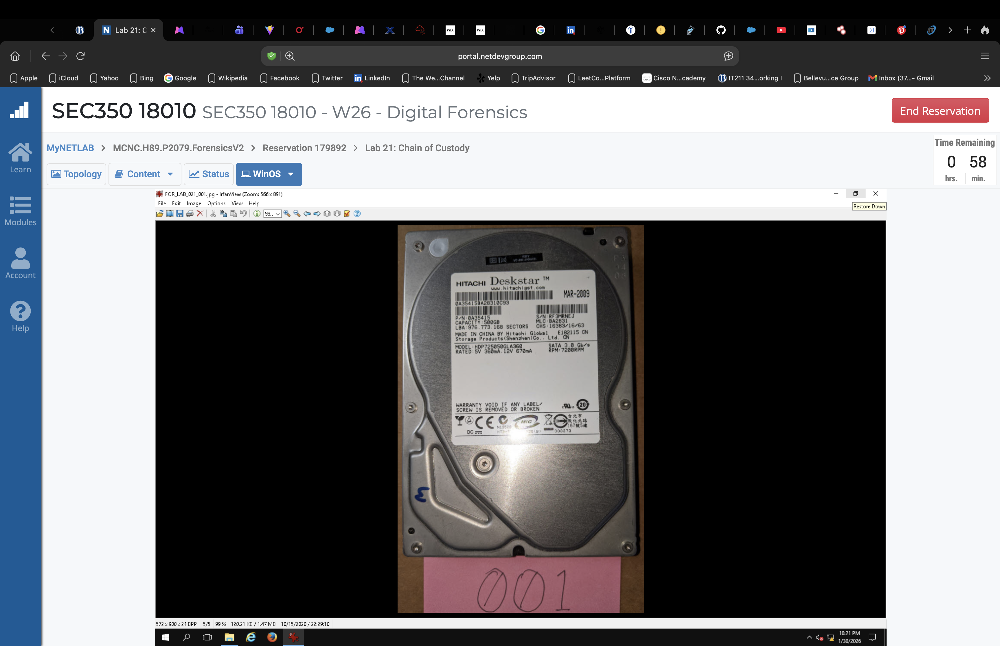

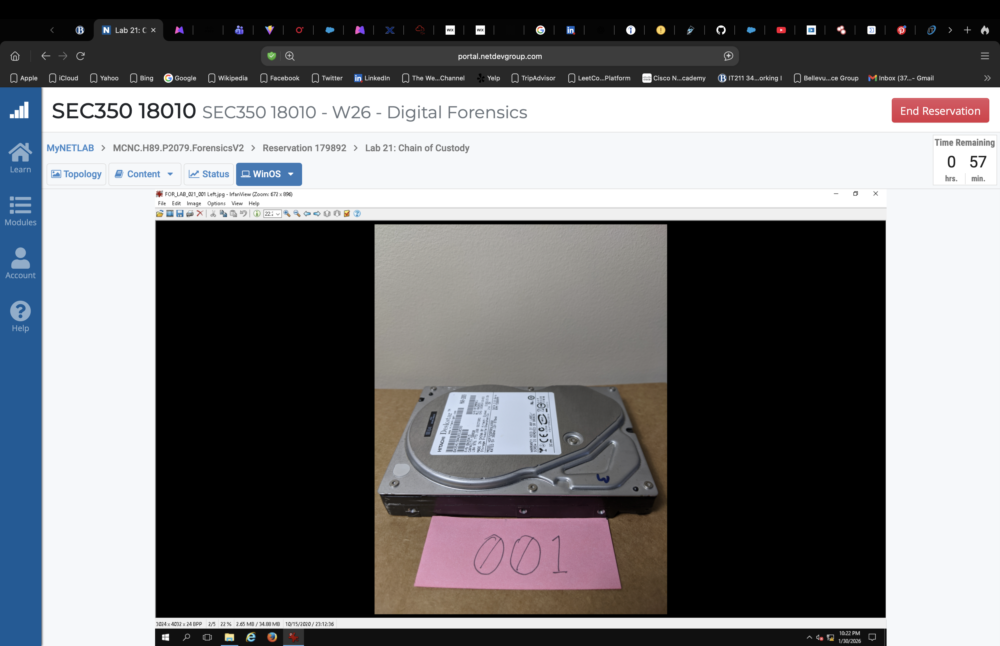

| Field | Value |
| --- | --- |
| Make/Manufacture | Hitachi |
| Model Number | HDP725050GLA360 |
| Serial Number (S/N) | RF3MRNEJ |
| Capacity | 500GB |
| Manufacture Date | March 2009 |

### Physical Description Notes:

* Silver-colored metal casing

* Scratches visible on top-left corner

* Number "3" written in blue marker on the label

* No visible dents or major damage

* Appears in good working condition

💡 Key Learning: The serial number is the most important identifier because it is unique to each device—no two drives share the same serial number.

## Evidence Item 002: Samsung Galaxy S7

The second exhibit was a mobile device requiring different identification methods.

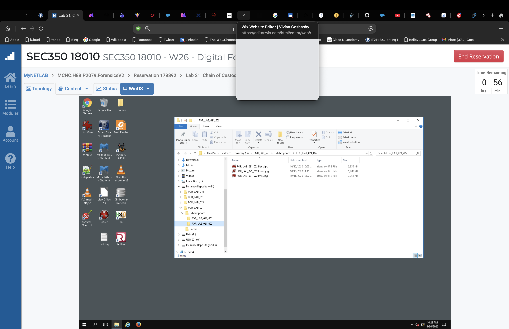
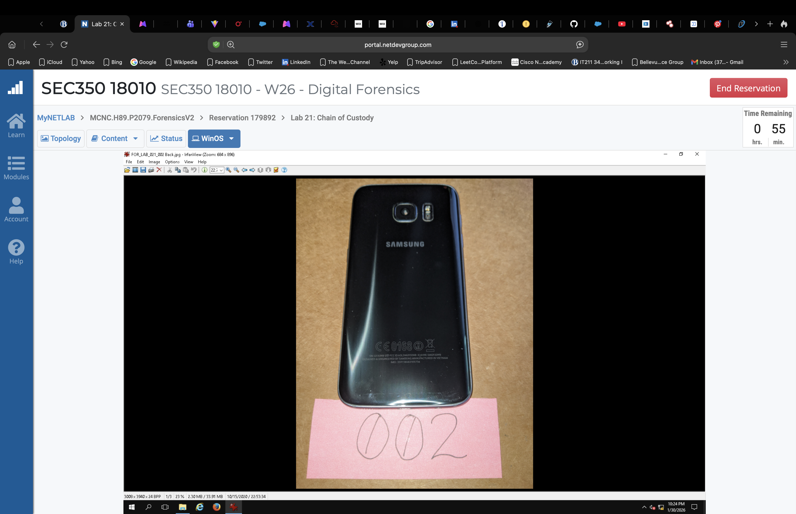
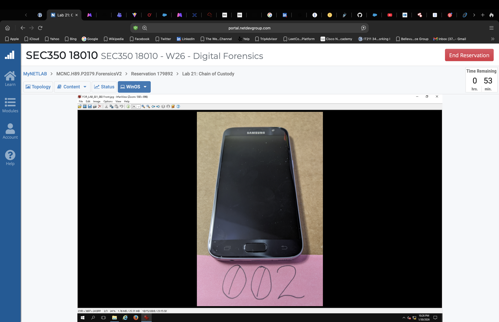

| Field | Value |
| --- | --- |
| Make/Model | Samsung Galaxy S7 / SM-G930W8 |
| IMEI | 359118083105756 |
| Serial Number (S/N) | R58JB2AL3QZ |
| Color | Blue |
| Physical Condition | No visible scratches or damage |

💡 Key Learning: Mobile devices use IMEI (International Mobile Equipment Identity) as their unique identifier instead of traditional serial numbers. Unlike serial numbers, IMEI is transmitted to service providers during calls and messages. The IMEI can be retrieved by dialing *#06# on the device.

## Part 2: Completing the Evidence Intake Form

Using the information gathered from Exhibit 001, I completed the NDG Evidence Intake Form.
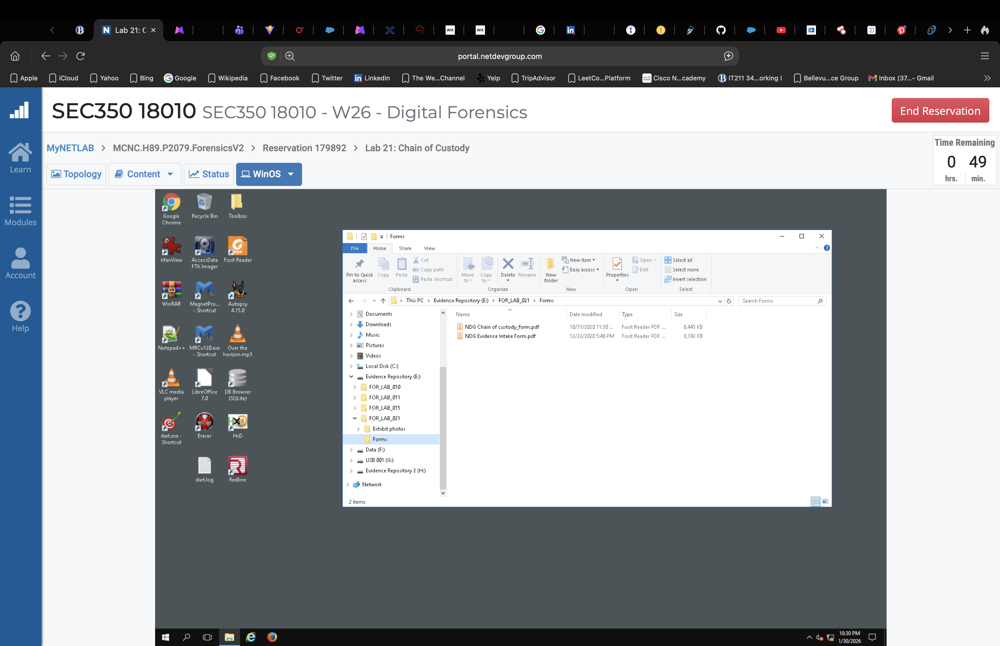
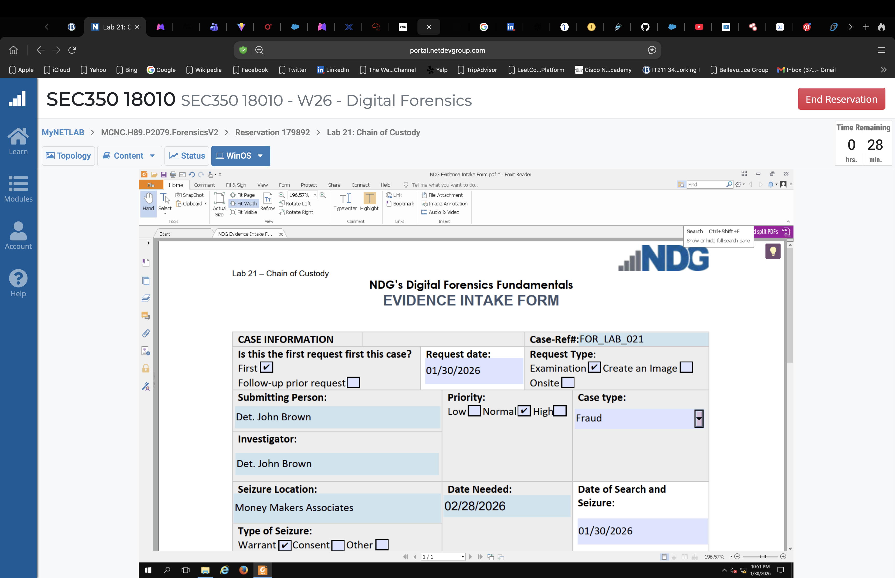
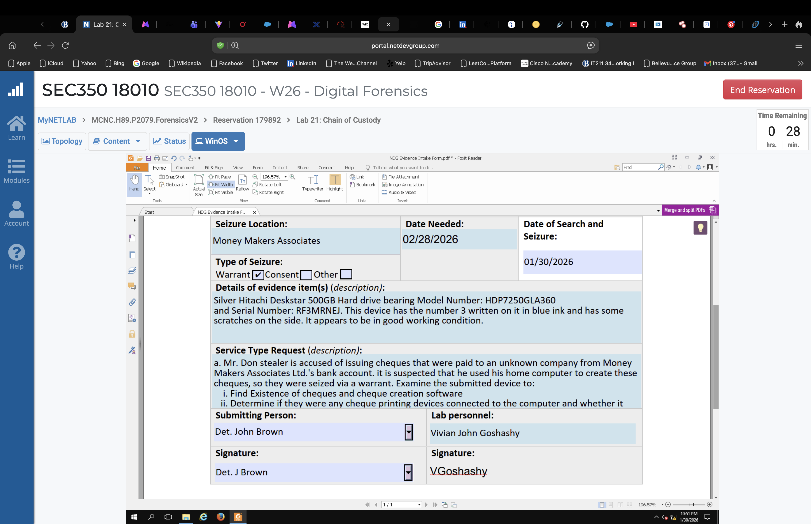

## Case Information Entered:

| Field | Value |
| --- | --- |
| Case Reference # | FOR_LAB_021 |
| Request Date | 01/30/2026 |
| Request Type | Examination |
| Submitting Person | Det. John Brown |
| Investigator | Det. John Brown |
| Priority | Normal |
| Crime Type | Fraud |
| Seizure Location | Money Makers Associates |
| Date Needed | 02/28/2026 |
| Date of Search/Seizure | 01/30/2026 |
| Type of Seizure | Warrant |   

## Evidence Description:

"Silver Hitachi Deskstar 500GB Hard drive bearing Model Number: HDP7250GLA360 and Serial Number: RF3MRNEJ. This device has the number 3 written on it in blue ink and has some scratches on the side. It appears to be in good working condition."

## Service Type Request (Examination Purpose):

"Mr. Don stealer is accused of issuing cheques that were paid to an unknown company from Money Makers Associates Ltd.'s bank account. It is suspected that he used his home computer to create these cheques, so they were seized via a warrant. Examine the submitted device to:

i. Find Existence of cheques and cheque creation software

ii. Determine if there were any cheque printing devices connected to the computer and whether it was used."

## Signatures:

| Role | Name | Signature |
| --- | --- | --- |
| Submitting Person | Det. John Brown | Det. J. Brown  |
| Lab Personnel | Vivian John Goshashy | VGoshashy    |

## File Naming Convention:

FOR_LAB_021-2026-01-30 Intake Form.pdf

💡 Key Learning: Proper file naming is essential for case organization. Format: CaseRef#-RequestDate(YYYY-MM-DD) DocumentType.pdf

## Part 3: Completing the Chain of Custody Form

The Chain of Custody form tracks evidence movement after intake.
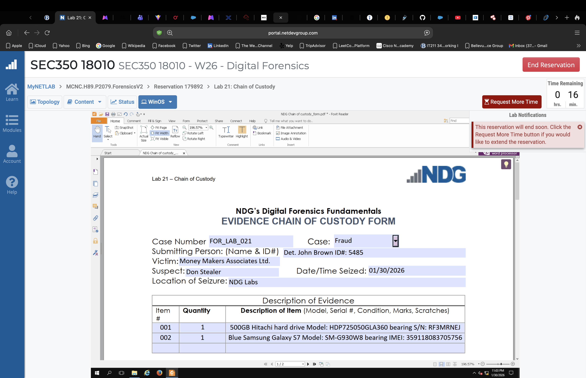
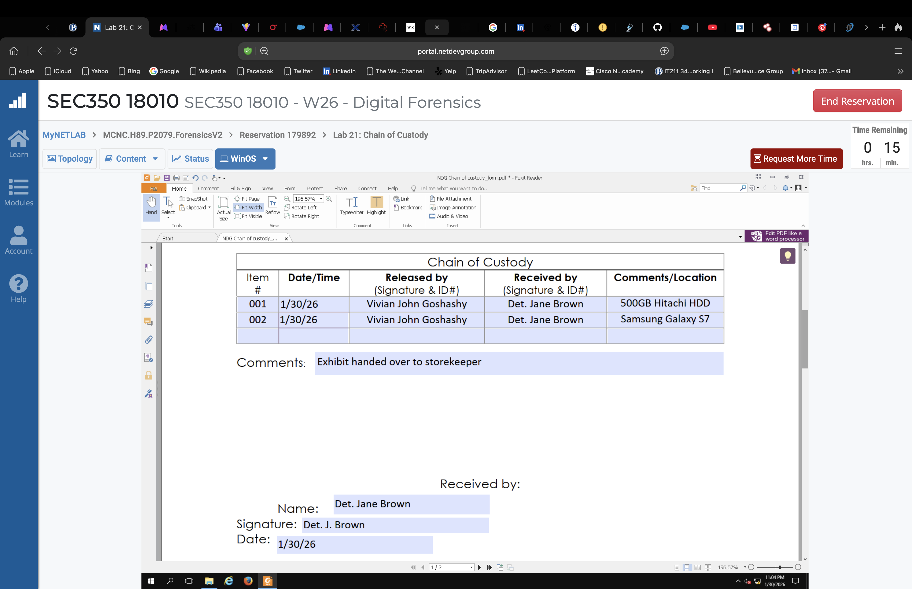
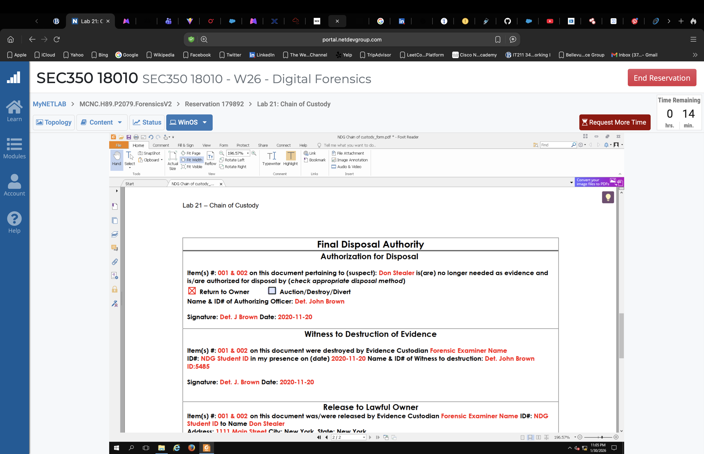

Evidence Description Table:

| Item # | Quantity | Description of Item |
| --- | --- | --- |
| 001 | 1 | 500GB Hitachi hard drive Model: HDP725050GLA360 bearing S/N: RF3MRNEJ  |
| 002 | 1 | Blue Samsung Galaxy S7 Model: SM-G930W8 bearing IMEI: 359118083705756   |

## Case Information:

| Field | Value |
| --- | --- |
| Case Number | FOR_LAB_021 |
| Case Type | Fraud |
| Submitting Person | Det. John Brown ID#: 5485 |
| Victim | Money Makers Associates Ltd. |
| Suspect | Don Stealer |
| Date/Time Seized | 01/30/2026 |
| Location of Seizure | NDG Labs |

## Chain of Custody Transfer:

| Item # | Date/Time | Released By |  Received By   |  Comments/Location   |
| --- | --- | --- | ---    |  ---    |
| 001 | 1/30/26 | Vivian John Goshashy  |  Det. Jane Brown   |   500GB Hitachi HDD   |
| 002 | 1/30/26 | Vivian John Goshashy  | Det. Jane Brown   | Samsung Galaxy S7   |

## Final Receipt:

| Name | Signature |  Date  |
| --- | --- | --- | 
| Det. Jane Brown | FDet. J. Brown | 1/30/26    |

## Final Disposal Authority (Reference):

The form includes a Final Disposal Authority section that documents how evidence is ultimately disposed of:

* Return to Owner

* Auction/Destroy/Divert

* Requires authorizing officer signature

* Requires witness to destruction

* Includes release to lawful owner information

💡 Key Learning: The Chain of Custody form continues beyond intake, documenting every transfer of evidence. Each person who handles the evidence must sign it out and the recipient must sign it in, creating an unbroken chain. The Final Disposal Authority section closes the loop on the evidence lifecycle.

## What I Learned

## 🔍 Documentation is Everything

Digital forensics isn't just about technical skills meticulous documentation is equally important. Without proper chain of custody, even the most compelling digital evidence can be excluded from court proceedings. This lab reinforced that the paperwork is just as critical as the technical analysis.

## 📝 Device Identification Nuances

* Hard drives: Serial numbers are unique identifiers; model numbers identify the product line. The Hitachi drive's serial number (RF3MRNEJ) is what makes it uniquely identifiable.

* Mobile devices: IMEI (359118083105756) serves as the unique identifier and is transmitted to carriers. Modern smartphones may also have separate serial numbers (R58JB2AL3QZ).

* Physical descriptions: Must include color, condition, markings, and damage—all details matter. The "3" written in blue ink and scratches on the hard drive could be crucial for identification.

## 📋 Forms Create the Chain

* Intake Form: Captures initial evidence receipt and establishes case context, including who submitted it, why, and what examination is requested.

* CoC Form: Tracks every movement of evidence after intake, creating a verifiable history of custody.

* Signatures: Each signature creates accountability and a verifiable handoff point. Note that I signed as the lab personnel (VGoshashy) releasing the evidence to Det. Jane Brown.

## 🏷️ File Management Matters

Forensic examiners handle massive amounts of documentation. Using consistent, descriptive file naming conventions (FOR_LAB_021-2026-01-30 CoC Form.pdf) ensures files can be located years later when cases go to trial.

## ⚖️ Legal Foundation

Chain of custody documentation answers critical questions that will be asked in court:

* Who seized the evidence? (Det. John Brown)
  
* Who handled it? (VGoshashy → Det. Jane Brown)

* When and where was it handled? (1/30/26 at NDG Labs)

* Was it secured properly between handoffs? (Documented transfers)

* Has the evidence been altered? (The chain documents every access)

## 🔄 The Complete Evidence Lifecycle

This lab demonstrated that evidence handling follows a complete lifecycle:

* Seizure - Documented on intake form

* Intake - Initial documentation at lab

* Storage - Handoff to storekeeper

* Examination - (To be documented in future labs)

* Disposal/Return - Final disposition documentation

## Conclusion

This lab demonstrated that proper evidence handling begins long before any forensic analysis occurs. The chain of custody is the foundation upon which the entire forensic investigation rests. By mastering these documentation procedures, I am building the habits necessary to ensure that any evidence I handle in my career will be admissible and defensible in court.

The hands-on experience with the NDG Forensics v2 environment provided realistic practice with the forms and procedures used in professional forensic laboratories. From identifying device identifiers to completing the intake and chain of custody forms, every step reinforced the importance of meticulous documentation in digital forensics.

